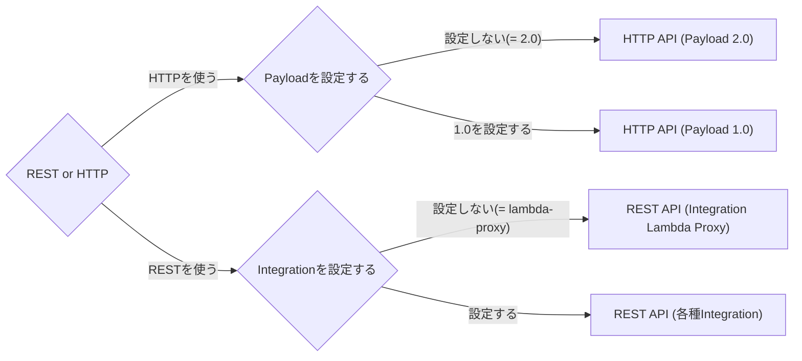

Serverless Frameworkでバックエンドを構築した際、API Gatewayの設定によって色々ハマったので調査してみました🔎

# 調べるきっかけになったお困りごと

API Gatewayと連携しているLambdaでHTTPヘッダーが上手く取得できないことがありました。

```python:handler.py
def hello(event, context):
    # 取得できたりできなかったりする
    access_token = event["headers"]["Authorization"]

    response = {
        "statusCode": 200,
        "access_token": access_token
    }

    return response
```

# 環境
Serverless Frameworkを使ってAPI GatewayとLambdaを構築していきます。

```
❯ serverless --version

Framework Core: 3.17.0
Plugin: 6.2.2
SDK: 4.3.2
```

プロジェクトは以下のコマンドで作成。言語はPythonを使います。

```
serverless create --template aws-python3
```


# 前提として知っておきたいこと 

## API GatewayにはREST API(v1)とHTTP API(v2)の2種類がある

2種類あることを知っておいたほうが良いでしょう。
API Gatewayだけで検索するとそれぞれ混在した情報が出てきますし、
REST APIやHTTP APIという単語も広く使われた用語なのでググラビリティが低く、
知りたい情報になかなかたどり着けないことも多い気がします。
挙動もそれぞれ結構違います。

詳細は後で見ていきますが、HTTP APIの方が後発で機能が少ない分高速かつ料金が安いそうです。
なのでHTTP APIで済ませられるのであれば可能な限りそちらを使った方が良いでしょう。

が、情報はRESTの方がまだまだ多そう＆多機能なので運用時の変更等には強いかもしれません。

詳しい差分は公式リファレンスや以下の記事を参照する良いと思います。

https://docs.aws.amazon.com/ja_jp/apigateway/latest/developerguide/http-api-vs-rest.html
https://dev.classmethod.jp/articles/amazon-api-gateway-http-or-rest/


## Serverless Frameworkを使用する場合、REST APIを使用する場合は`http`、HTTP APIを使用する場合は`httpApi`を設定する

Serverless Frameworkを使用する場合は`serverless.yml`の`functions.関数名.events`で`http`を設定すればREST API(v1)、`httpApi`を設定すればHTTP API(v2)がデプロイされます。
（名前ややこしい・・・）

それぞれ設定内容は似ていますが、差分のある箇所もところどころあります。
公式リファレンスをしっかり読んだほうが良さそうです。

以下は最小限の設定

```yml:serverless.yml
service: serverless-playground
frameworkVersion: '3'

provider:
  name: aws
  runtime: python3.8
  region: ap-northeast-1

functions:
  hello:
    handler: handler.hello
    events:
      # HTTP API(v2)を使用する場合の設定 
      - httpApi:
          path: /hello-http-api
          method: get
      # REST API(v1)を使用する場合の設定
      - http:
          path: /hello-http
          method: get
```

https://www.serverless.com/framework/docs/providers/aws/events/apigateway

https://www.serverless.com/framework/docs/providers/aws/events/http-api

## v1の場合はintegration, v2の場合はpayloadの設定により挙動が変わる

図にすると以下のようにパターン化されると思います。



`HTTP API (Payload 2.0)`と`REST API (Integration Lambda Proxy)`は
Serverless Frameworkでのデフォルトなので1パターンとして切り出しています。

今回はこの4パターンをデプロイして挙動を観察してみます。
Integrationについて色々種類がありますが、今回は`lambda-proxy(デフォルト)`と`lambda`を設定してみます。

また、込み入ったことをやろうと思うとマッピングテンプレートを使うような場合もありそうですが、今回はそれらは含みません。


# とりあえずデプロイしてみる

今回は以下の4つのエンドポイントを用意し、それぞれ同じLambda関数を呼ぶこととします。

- /hello-http/{message}  (REST API(v1)のデフォルト設定)
- /hello-http-api/{message}  (HTTP API(v2)のデフォルト設定)
- /hello-http-integration-lambda/{message}  (REST API(v1)で`integration: lambda`を設定)
- /hello-http-api-payload-v1/{message}  (HTTP API(v2)で`payload: '1.0'`を設定)

Lambda関数は引数に受け取るeventオブジェクトを返すようにします。

ということで以下のようにServerless Frameworkで作成したプロジェクトを書き換えてデプロイしてみます。

```python:handler.py
import json

def hello(event, context):
    print(json.dumps(event))

    body = {
        "event": event
    }

    response = {
        "statusCode": 200,
        "body": json.dumps(body)
    }

    return response
```

```yml:serverless.yml
service: serverless-playground
frameworkVersion: '3'

provider:
  name: aws
  runtime: python3.8
  region: ap-northeast-1

functions:
  # REST HTTPそれぞれデフォルトで設定
  hello:
    # 共通の関数を異なる設定で呼び出すようにする
    handler: handler.hello
    events:
      # REST API(v1)の設定
      - http:
          path: /hello-http/{message}
          method: get
      # HTTP API(v2)の設定
      - httpApi:
          path: /hello-http-api/{message}
          method: get
      
  # RESTにはintegration、HTTPにはPayloadを設定
  hello2:
    handler: handler.hello
    # httpApiでpayload 1.0を使う設定
    httpApi:
      payload: '1.0'
    events:
      - http:
          path: /hello-http-integration-lambda/{message}
          method: get
          # Integrationを設定
          integration: lambda
      - httpApi:
          path: /hello-http-api-payload-v1/{message}
          method: get
```

```
serverless deploy
```

デプロイに成功すると以下のようにエンドポイントが表示されます。
**REST APIの場合はstageが含まれていますが、HTTP APIの場合はstageは含まれません。**

```
Deploying serverless-playground to stage dev (ap-northeast-1)

✔ Service deployed to stack serverless-playground-dev (146s)

endpoints:
  GET - https://xxxxxxxx.execute-api.ap-northeast-1.amazonaws.com/dev/hello-http/{message}
  GET - https://xxxxxxxx.execute-api.ap-northeast-1.amazonaws.com/dev/hello-http-integration-lambda/{message}
  GET - https://yyyyyyyy.execute-api.ap-northeast-1.amazonaws.com/hello-http-api/{message}
  GET - https://yyyyyyyy.execute-api.ap-northeast-1.amazonaws.com/hello-http-api-payload-v1/{message}
functions:
  hello: serverless-playground-dev-hello (2.2 MB)
  hello2: serverless-playground-dev-hello2 (2.2 MB)
```


# eventオブジェクト内の構造を見てみる

デプロイできたのでそれぞれcurlを叩いて結果を見ていきます。

今回はAuthorizationヘッダーとQuery Stringsとして`input=12345`, `params=1` , `params=2`を付与してみました。
以下の例ではレスポンスが見やすくなるようにjqで整形し、外部ファイルに保存しています。

```:/hello-httpリクエストし、レスポンスをhello-http.jsonという名前で保存
curl --silent \
     -H 'Authorization:Bearer xxxxxxxxxxxxxxxxxx' \
     'https://xxxxxxxx.execute-api.ap-northeast-1.amazonaws.com/dev/hello-http/message?input=12345&params=1&params=2' \
| jq > hello-http.json
```

```:/hello-http-apiにリクエストし、レスポンスをhello-http-api.jsonという名前で保存
curl --silent \
     -H 'Authorization:Bearer xxxxxxxxxxxxxxxxxx' \
     'https://yyyyyyyy.execute-api.ap-northeast-1.amazonaws.com/hello-http-api/message?input=12345&params=1&params=2' \
| jq > hello-http-api.json
```

```:/hello-http-integration-lambdaリクエストし、レスポンスをhello-http-integration-lambda.jsonという名前で保存
curl --silent \
     -H 'Authorization:Bearer xxxxxxxxxxxxxxxxxx' \
     'https://xxxxxxxx.execute-api.ap-northeast-1.amazonaws.com/dev/hello-http-integration-lambda/message?input=12345&params=1&params=2' \
| jq > hello-http-integration-lambda.json
```

```:/hello-http-api-payload-v1にリクエストし、レスポンスをhello-http-api-payload-v1.jsonという名前で保存
curl --silent \
     -H 'Authorization:Bearer xxxxxxxxxxxxxxxxxx' \
     'https://yyyyyyyy.execute-api.ap-northeast-1.amazonaws.com/hello-http-api-payload-v1/message?input=12345&params=1&params=2' \
| jq > hello-http-api-payload-v1.json
```

これらを比較すると差分が結構あるのがわかると思います。

## REST API(v1) vs HTTP API(v2)

まずはheadersを見てみます。
色々差分がありますが、HTTP APIの場合はキーが小文字に統一されています。

（以下のJSONは部分的にマスクしている箇所があります）

```json:hello-http.json
{
  "event": {
    "resource": "/hello-http/{message}",
    "path": "/hello-http/message",
    "httpMethod": "GET",
    "headers": {
      "Accept": "*/*",
      "Authorization": "Bearer xxxxxxxxxxxxxxxxxx",
      "CloudFront-Forwarded-Proto": "https",
      "CloudFront-Is-Desktop-Viewer": "true",
      "CloudFront-Is-Mobile-Viewer": "false",
      "CloudFront-Is-SmartTV-Viewer": "false",
      "CloudFront-Is-Tablet-Viewer": "false",
      "CloudFront-Viewer-Country": "JP",
      "Host": "xxxxxxxx.execute-api.ap-northeast-1.amazonaws.com",
      "User-Agent": "curl/7.64.1",
      "Via": "2.0 zzzzzzzzzzzzzzz.cloudfront.net (CloudFront)",
      "X-Amz-Cf-Id": "X-Amz-Cf-Id",
      "X-Amzn-Trace-Id": "Root=X-Amzn-Trace-Id",
      "X-Forwarded-For": "x.x.x.x, y.y.y.y",
      "X-Forwarded-Port": "443",
      "X-Forwarded-Proto": "https"
    },
    // ・・・
  }
}
```

```json:hello-http-api.json
{
  "event": {
    "version": "2.0",
    "routeKey": "GET /hello-http-api/{message}",
    "rawPath": "/hello-http-api/message",
    "rawQueryString": "input=12345&params=1&params=2",
    "headers": {
      "accept": "*/*",
      "authorization": "Bearer xxxxxxxxxxxxxxxxxx",
      "content-length": "0",
      "host": "yyyyyyyy.execute-api.ap-northeast-1.amazonaws.com",
      "user-agent": "curl/7.64.1",
      "x-amzn-trace-id": "Root=X-Amzn-Trace-Id",
      "x-forwarded-for": "x.x.x.x",
      "x-forwarded-port": "443",
      "x-forwarded-proto": "https"
    },
    // ・・・
  }
}
```

冒頭のお困りごとは値を取り出す際、HTTP APIの場合はキーを小文字に直してあげれば解決できそうです。
両方とも共存させるような場合であればLambda関数内で分岐する必要がありそうです。

```python:handler.py
def hello(event, context):
    access_token = ""
    # v1とv2が共存する場合はなにかしら分岐する
    if "Authorization" in event["headers"]:
        access_token = event["headers"]["Authorization"]
    else:
        access_token = event["headers"]["authorization"]
    

    response = {
        "statusCode": 200,
        "access_token": access_token
    }

    return response
```

まぁこれでも良いのですが、[RFC7230](https://datatracker.ietf.org/doc/html/rfc7230#section-3.2)としてはリクエストヘッダーはcase-insensitiveにすべしであったり、[RFC7540](https://datatracker.ietf.org/doc/html/rfc7540#section-8.1.2)にはHTTP/2.0だと小文字って書かれてたりするので、要件にも依りますが、大文字小文字関係なく扱えるようにしておくのが無難そうです。

今回は試していませんが以下のIssueで色々議論されており、Pythonの場合は[requestの`CaseInsensitiveDict`](https://github.com/psf/requests/blob/v1.2.3/requests/structures.py#L37)が使えるかもしれません。

https://github.com/serverless/serverless/issues/2765#issuecomment-431464815


次にQuery Stringsの差分を見てみます。

```json:hello-http.json
{
  "event": {
    // ・・・
   "queryStringParameters": {
      "input": "12345",
      "params": "2"
    },
    "multiValueQueryStringParameters": {
      "input": [
        "12345"
      ],
      "params": [
        "1",
        "2"
      ]
    },
    "pathParameters": {
      "message": "message"
    },
    // ・・・
  }
}
```

```json:hello-http-api.json
{
  "event": {
    // ・・・
   "queryStringParameters": {
      "input": "12345",
      "params": "1,2"
    },
    "pathParameters": {
      "message": "message"
    },
    // ・・・
  }
}
```

複数のQuery Stringsが設定されている場合の挙動に違いがあります。
REST APIの場合は`queryStringParameters`では後勝ち、複数値は`multiValueQueryStringParameters`に配列として格納されるのに対し、HTTP APIの場合は`multiValueQueryStringParameters`のパラメータがなく、代わりに`queryStringParameters`内のデータがカンマ区切りで設定されています。

その他にも様々な差分がありますが、全体的にREST APIの方が設定値が多く、込み入ったことをしようとするとRESTにせざるを得ないこともあるかもしれないです。
が、シンプルなものであればHTTP APIでも必要十分そうだと思いました。
（あくまでeventオブジェクトの内容を見ての感覚です。）

## HTTP API Payload 2.0 vs 1.0
HTTP APIを使用する際にPayloadを1.0に設定すると、eventオブジェクトの中身がREST APIに似た構造になります。

```json:hello-http-api-payload-v1.json
{
  "event": {
    "version": "1.0",
    "resource": "/hello-http-api-payload-v1/{message}",
    "path": "/hello-http-api-payload-v1/message",
    "httpMethod": "GET",
    "headers": {
      "Content-Length": "0",
      "Host": "yyyyyyyy.execute-api.ap-northeast-1.amazonaws.com",
      "User-Agent": "curl/7.64.1",
      "X-Amzn-Trace-Id": "Root=X-Amzn-Trace-Id",
      "X-Forwarded-For": "x.x.x.x",
      "X-Forwarded-Port": "443",
      "X-Forwarded-Proto": "https",
      "accept": "*/*",
      "authorization": "Bearer xxxxxxxxxxxxxxxxxx"
    },
    // ・・・
    "queryStringParameters": {
      "input": "12345",
      "params": "2"
    },
    "multiValueQueryStringParameters": {
      "input": [
        "12345"
      ],
      "params": [
        "1",
        "2"
      ]
    },
    // ・・・
  }
}
```

headersの値はPayload 2.0と異なり大文字の値もありますが、`authorization`などは小文字で設定されていたりして混在しています。
Query Stringsの値はREST APIと同じように扱えるようになっています。


## REST API Integration Lambda Proxy vs Integration Lambda
`integration: lambda`を設定するとLambda関数でreturnした値がそのままレスポンスボディとして返されます。

```json:hello-http-integration-lambda.json
{
  "statusCode": 200,
  "body": "{\"event\": ・・・}"
}
```

このままだとeventオブジェクトの比較ができないので、ログを見ます。
（handler.pyでprintしているので出力されているはず）

```json:event-integration-lambda.json
{
    "body": {},
    "method": "GET",
    "principalId": "",
    "stage": "dev",
    "cognitoPoolClaims": {
        "sub": ""
    },
    "enhancedAuthContext": {},
    "headers": {
        "Accept": "*/*",
        "Authorization": "Bearer xxxxxxxxxxxxxxxxxx",
        "CloudFront-Forwarded-Proto": "https",
        "CloudFront-Is-Desktop-Viewer": "true",
        "CloudFront-Is-Mobile-Viewer": "false",
        "CloudFront-Is-SmartTV-Viewer": "false",
        "CloudFront-Is-Tablet-Viewer": "false",
        "CloudFront-Viewer-Country": "JP",
        "Host": "xxxxxxxx.execute-api.ap-northeast-1.amazonaws.com",
        "User-Agent": "curl/7.64.1",
        "Via": "2.0 zzzzzzzzzzzzzzz.cloudfront.net (CloudFront)",
        "X-Amz-Cf-Id": "X-Amz-Cf-Id",
        "X-Amzn-Trace-Id": "Root=X-Amzn-Trace-Id",
        "X-Forwarded-For": "x.x.x.x, y.y.y.y",
        "X-Forwarded-Port": "443",
        "X-Forwarded-Proto": "https"
    },
    "query": {
        "input": "12345",
        "params": "2"
    },
    "path": {
        "message": "message"
    },
    // ・・・
}
```

headersの値はそこまで差分はありませんが、`queryStringParameters`が`query`となっていたり、
`pathParameters`が`path`となっていたりします。
参照する情報によってはこの辺り混在しやすいので気をつけましょう。

また、`multiValueQueryStringParameters`に該当するが無かったり、
`queryStringParameters`の値を見ても後勝ちになっているので複数値のQuery Stringは扱えなさそうです。

# CORSを設定してみる
最後にCORSの設定をして動かしてみます。
Serverless Frameworkでこれらを設定する場合、httpとhttpApiとで設定の仕方に差分があります。

## HTTP APIでのCORS設定

まず、HTTP APIを使用している場合は以下の手順になります。
`serverless.yml`のproviderに設定さえすればOKです。簡単です。

https://www.serverless.com/framework/docs/providers/aws/events/http-api#cors-setup


```yml:serverless.yml
service: serverless-playground
frameworkVersion: '3'

provider:
  name: aws
  runtime: python3.8
  region: ap-northeast-1
  httpApi:
    cors: true
  # 略
```

## REST APIでのCORS設定

次にREST APIでの設定です。
以下の記事が参考になりました。
https://www.serverless.com/blog/cors-api-gateway-survival-guide/

まずは`serverless.yml`に設定を追記します。
`functions.関数名.events.http`に`cors`設定します。

```yml:serverless.yml
# 略

# HTTP APIの設定は省略
functions:
  hello:
    handler: handler.hello
    events:
      - http:
          path: /hello-http/{message}
          method: get
          # 追記
          cors: true
      
  hello2:
    handler: handler.hello
    events:
      - http:
          path: /hello-http-integration-lambda/{message}
          method: get
          # 追記
          integration: lambda
          cors: true
```

ここまでだと`integration: lambda`を設定している方は動作します。

デフォルト（lambda-proxy）の方はこれだけだとまだ動きません。
Lambda IntegrationとLambda Proxy Integrationとで
Lambda関数が返す値をどう扱うのかが違うためだと思われます。

デフォルトの方を動かすためにLambda関数を編集してレスポンスヘッダを返すようにします。
また、Lambda関数に手を加えると他のエンドポイントにも影響があるので新しくhandler2.pyを作成します。

```python:handler2.py
import json


def hello(event, context):
    print(json.dumps(event))

    body = {
        "event": event
    }
    response = {
        "statusCode": 200,
        # 追記
        "headers": {
            'Access-Control-Allow-Origin': '*',
            'Access-Control-Allow-Credentials': True,
        },
        "body": json.dumps(body)
    }

    return response
```

```yml:serverless.yml
# 略

# HTTP APIの設定は省略
functions:
  # 新しくファイルを作ったので修正。関数名もHTTP APIのものと分離
  helloHttpCors:
    handler: handler2.hello
    events:
      - http:
          path: /hello-http/{message}
          method: get
          cors: true
```

ここまでで４パターン全てCORS対応できたはずです。

# 最終的に出来上がったもの

```yml:serverless.yml
service: serverless-playground
frameworkVersion: '3'

provider:
  name: aws
  runtime: python3.8
  region: ap-northeast-1
  httpApi:
    cors: true

functions:
  hello:
    handler: handler.hello
    events:
      # HTTP API(v2)の設定
      - httpApi:
          path: /hello-http-api/{message}
          method: get
  # CORS設定用にhelloから分離
  helloHttpCors:
    handler: handler2.hello
    events:
      # REST API(v1)の設定
      - http:
          path: /hello-http/{message}
          method: get
          cors: true      
  # RESTにはintegration HTTPにはPayloadを設定
  hello2:
    handler: handler.hello
    # httpApiでpayload 1.0を使う設定
    httpApi:
      payload: '1.0'
    events:
      - http:
          path: /hello-http-integration-lambda/{message}
          method: get
          # Integrationを設定
          integration: lambda
          cors: true
      - httpApi:
          path: /hello-http-api-payload-v1/{message}
          method: get
```

```python:handler.py
import json

def hello(event, context):

    body = {
        "event": event
    }
    response = {
        "statusCode": 200,
        "body": json.dumps(body)
    }

    return response
```

```python:handler2.py
import json

def hello(event, context):

    body = {
        "event": event
    }
    response = {
        "statusCode": 200,
        # 追記
        "headers": {
            'Access-Control-Allow-Origin': '*',
            'Access-Control-Allow-Credentials': True,
        },
        "body": json.dumps(body)
    }

    return response
```

# まとめ
Serverless Frameworkを使ってAPI GatewayとLambdaを構築してきました。
手軽にサーバーレス基盤を構築できるのは素晴らしいですが、API GatewayやLambdaの仕様をある程度理解できていないと
ハマりどころがとても多かったです。
（REST APIやHTTP API, http, httpApiのググラビリティなど・・・）

ポイントを抑えて効率の良いサーバーレス開発をしていきたいですね🚀